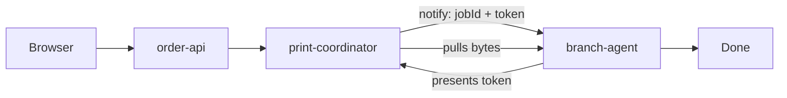
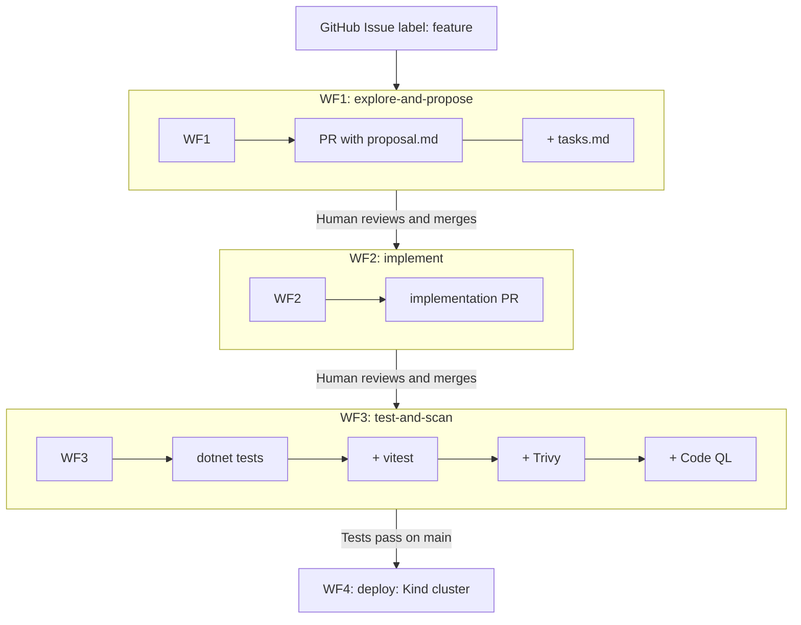

# Covert OMS

A demo microservices project showcasing modern .NET 8 + React architecture with an AI-driven CI/CD pipeline.

**Covert** is an imaginary confidential document printing service. Customers submit print jobs, choose a local branch, and the system coordinates printing without ever exposing the raw document to the branch printer.

---

## GitHub Workflow Inventory

This repository includes GitHub Actions workflows for the AI-assisted proposal, implementation, test, scan, and deployment path. Treat these as starter harnesses: customize triggers, permissions, secrets, model/provider settings, scan gates, branch names, and deployment targets before using them for a real project.

| Workflow | Purpose | Status | `harness` usage |
|---|---|---|---|
| [`explore-and-propose.yml`](.github/workflows/explore-and-propose.yml) | WF1. When an issue is labeled `feature`, generates an opsx proposal and task list, commits them under `changes/{slug}/`, and opens a proposal PR.  | ✅ Beta | `.github/scripts/harness.py --mode meta` and `--mode run` |
| [`implement.yml`](.github/workflows/implement.yml) | WF2. When an approved `changes/**/tasks.md` lands on `main`, detects the changed task file, runs the selected AI CLI, commits the implementation, and opens an implementation PR.  | ✅ Beta | `.github/scripts/harness.py --mode implement-detect` and `--mode implement-run` |
| [`test-and-scan.yml`](.github/workflows/test-and-scan.yml) | WF3. Runs backend tests, frontend tests, Docker image builds, Trivy scans, and CodeQL on pull requests.  | 📋 Alpha | `.github/scripts/harness.py --mode test-scan` with `dotnet`, `frontend`, and `docker-build` scan modes |
| [`deploy.yml`](.github/workflows/deploy.yml) | WF4. After the `Test and Scan` workflow succeeds on `main`, builds images, deploys to a temporary Kind cluster, runs a smoke test, and cleans up.  | 📋 Alpha | Not used |
| [`dummy-explore-and-propose.yml`](.github/workflows/dummy-explore-and-propose.yml) | Disabled sample/dummy version of the explore-and-propose flow for local workflow experimentation, without any LLM calls saving costs.  | ✅ Stable | `.github/scripts/harness.py --mode meta` and `--mode run --provider dummy` |

The shared workflow harness is [`harness.py`](.github/scripts/harness.py). It supports `meta`, `run`, `implement-detect`, `implement-prompt`, `implement-run`, and `test-scan` modes.

---

## Architecture



Three .NET 8 microservices communicate over HTTP REST:

| Service | Port | Role |
|---|---|---|
| `order-api` | 5001 | Customer-facing API. Accepts print jobs, returns status. |
| `print-coordinator` | 5002 | Internal orchestrator. Issues short-lived tokens; stores document bytes. |
| `branch-agent` | 5003 | Simulates a branch printer. Pulls bytes via token; discards after printing. |
| `frontend` | 3000 | React/Vite UI. Submit jobs, pick branch, track status. |

**Key design:** The branch-agent never receives document bytes directly. The coordinator issues a one-time token; the branch must present it to pull the bytes — which are then destroyed. This is the core confidentiality pattern.

---

## Tech Stack

- **Backend:** .NET 8 ASP.NET Core (minimal APIs)
- **Frontend:** React 18 + TypeScript + Vite
- **Testing:** xUnit + FluentAssertions (backend), Vitest + React Testing Library (frontend)
- **Containers:** Docker + Docker Compose
- **Local k8s:** Kind
- **CI/CD:** GitHub Actions (4 workflows)

---

## Quick Start

**Run everything locally with Docker Compose:**

```bash
docker compose -f infra/docker-compose.yml up --build
```

| URL | What |
|---|---|
| http://localhost:3000 | React frontend |
| http://localhost:80 | Nginx proxy (frontend + API) |
| http://localhost:5001/swagger | order-api Swagger UI |
| http://localhost:5002/swagger | print-coordinator Swagger UI |
| http://localhost:5003/swagger | branch-agent Swagger UI |

**Run .NET tests:**

```bash
dotnet restore CovertOms.sln
dotnet test CovertOms.sln
```

**Run frontend tests:**

```bash
cd frontend && npm install && npm run test
```

---

## AI-Driven Development Pipeline

New features flow through 4 GitHub Actions workflows powered by [Claude Code](https://github.com/anthropics/claude-code-action):

```
GitHub Issue (labeled: feature)
        ↓
  WF1: explore-and-propose  →  PR with proposal.md + tasks.md
        ↓ human reviews and merges
  WF2: implement             →  implementation PR
        ↓ human reviews and merges
  WF3: test-and-scan         →  dotnet tests + vitest + Trivy + CodeQL
        ↓ tests pass on main
  WF4: deploy                →  Kind cluster
```


| Workflow | Trigger | What it does |
|---|---|---|
| [WF1 `explore-and-propose`](.github/workflows/explore-and-propose.yml) | Issue labeled `feature` | Runs `/opsx:explore` + `/opsx:propose` → opens PR with `changes/{slug}/proposal.md` and `tasks.md` |
| [WF2 `implement`](.github/workflows/implement.yml) | Proposal PR merged | Reads approved `tasks.md` → runs `/coder` → opens implementation PR |
| [WF3 `test-and-scan`](.github/workflows/test-and-scan.yml) | Any PR | dotnet tests, vitest, Trivy container scan, CodeQL analysis (parallel) |
| [WF4 `deploy`](.github/workflows/deploy.yml) | Tests pass on `main` | Builds images, loads into Kind, applies manifests, smoke tests |

**To trigger the pipeline:**
1. Create a GitHub Issue describing the feature
2. Add the `feature` label
3. Review the generated `proposal.md` and `tasks.md` in the PR
4. Merge to kick off implementation

---

## Project Structure

```
covert-oms/
├── .github/
│   ├── actions/install-ai-cli/   # Composite action for Codex/OpenCode
│   ├── workflows/                # 4 CI/CD workflows
│   └── ISSUE_TEMPLATE/
├── changes/                      # opsx proposals land here (proposal.md + tasks.md)
├── services/
│   ├── order-api/                # src/ + tests/ + Dockerfile
│   ├── print-coordinator/        # src/ + tests/ + Dockerfile
│   └── branch-agent/             # src/ + tests/ + Dockerfile
├── frontend/                     # React app + component tests + Dockerfile
├── infra/
│   ├── docker-compose.yml
│   ├── nginx/
│   └── kind/                     # cluster config + k8s manifests
└── CovertOms.sln
```

---

## Configuration

**Required GitHub secret:**

| Secret | Used by |
|---|---|
| `ANTHROPIC_API_KEY` | `claude-code-action` (WF1 + WF2) |

**Optional GitHub variable:**

| Variable | Default | Options |
|---|---|---|
| `AI_CLI` | `claude` | `claude`, `codex`, `opencode` |

Setting `AI_CLI=codex` or `AI_CLI=opencode` switches WF1/WF2 to use Codex or OpenCode CLI instead of Claude Code Action (requires `OPENAI_API_KEY` or `OPENCODE_API_KEY`).

---

## Local Kind Deployment

```bash
kind create cluster --config infra/kind/cluster-config.yaml --name covert-oms
docker compose -f infra/docker-compose.yml build
kind load docker-image covert-oms-order-api:latest --name covert-oms
kind load docker-image covert-oms-print-coordinator:latest --name covert-oms
kind load docker-image covert-oms-branch-agent:latest --name covert-oms
kind load docker-image covert-oms-frontend:latest --name covert-oms
kubectl apply -f infra/kind/manifests/
kubectl rollout status deployment/order-api -n covert-oms
```
